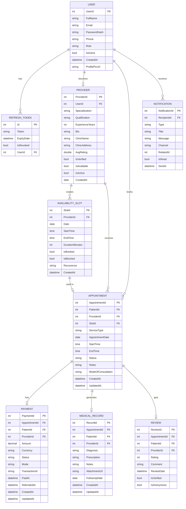
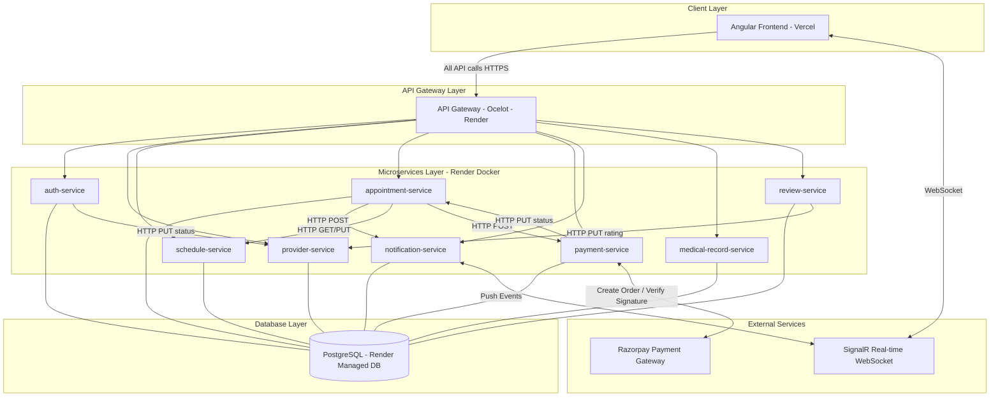
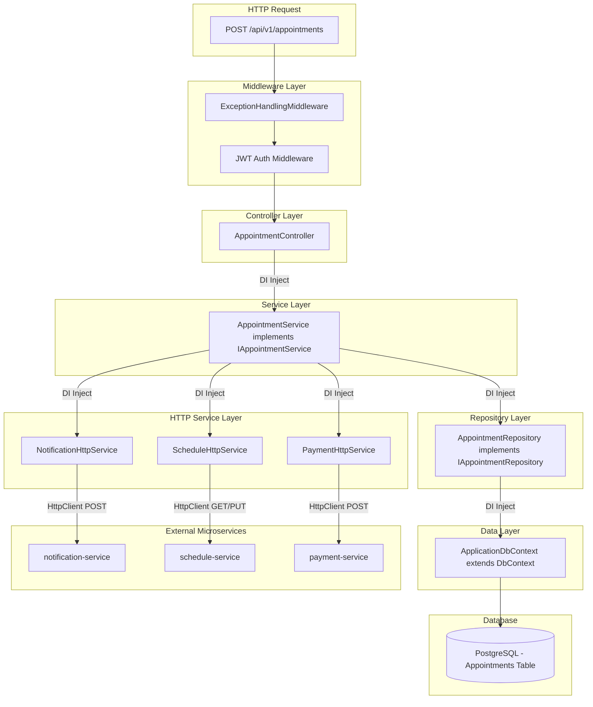

# MediBook — Backend API

A microservices healthcare management system built with ASP.NET Core, EF Core, PostgreSQL, and an API Gateway.

## Architecture & Services

All client traffic routes through a unified **API Gateway** down to independent domain services.

```text
API Gateway (Port 5000)
 │
 ├── AuthService          (5002) - JWT Auth & Role management
 ├── AppointmentService   (5003) - Appointment lifecycle & tracking
 ├── PaymentService       (5004) - Billing & secure transactions
 ├── ReviewService        (5005) - Patient feedback & ratings
 ├── NotificationService  (5006) - Automated alerts & reminders
 ├── MedicalRecordService (5007) - Clinical notes & histories
 ├── ProviderService      (5117) - Provider profiles & specialties
 └── ScheduleService      (5298) - Availability & time-slots
```

*Note: Each service follows a standard layered architecture (`Controllers`, `Services`, `Repositories`, `Entities`, `DTOs`).*

## Tech Stack

*   **Framework:** .NET 8 / ASP.NET Core
*   **Database:** PostgreSQL (Entity Framework Core)
*   **Auth:** JWT Bearer tokens
*   **API Docs:** Swagger / OpenAPI

## Getting Started

### 1. Configure Connection Strings
Update `appsettings.json` in each service directory with your local PostgreSQL connection string:
```json
"ConnectionStrings": { "DefaultConnection": "Host=localhost;Database=MediBook_{Service}DB;Username=postgres;Password=pass;" }
```

### 2. Apply Database Migrations
From the solution root, apply EF Core migrations for each service to generate your schemas:
```bash
dotnet ef database update --project MediBook/services/auth-service
# Repeat for appointment, payment, review, medical-record, provider, and schedule services.
```

### 3. Run Services
Start the API Gateway and the required microservices using the .NET CLI:
```bash
dotnet run --project MediBook/services/api-gateway
# Repeat for other services as needed.
```

## API Docs & Auth

*   **Swagger UI:** Available at `http://localhost:{PORT}/swagger` for each individual service.
*   **Authentication:** Obtain a JWT via `POST /api/auth/login` (through Gateway port 5000). Pass it in the `Authorization: Bearer <token>` header for secured routes.

## Testing

Run all unit/integration tests from the solution root:
```bash
dotnet test
```

---

## ER Diagram



---

## Architectural Diagram



---

## Low Level Design



---

## UML Class Diagram

```mermaid
classDiagram
    class IAppointmentService {
        <<interface>>
        +BookAppointmentAsync(appointment) Task~Appointment~
        +BookAppointment(appointment) Appointment
        +GetById(id) Appointment
        +GetByPatient(patientId) List~Appointment~
        +CancelAppointmentAsync(id) Task
        +RescheduleAppointmentAsync(id, slotId) Task~Appointment~
        +UpdateStatusAsync(id, status) Task~string~
        +GetAllAppointments() List~Appointment~
    }

    class IAppointmentRepository {
        <<interface>>
        +Add(appointment) void
        +Update(appointment) void
        +Delete(appointment) void
        +GetById(id) Appointment
        +FindByPatientId(id) List~Appointment~
        +FindByProviderId(id) List~Appointment~
        +FindBySlotId(id) Appointment
        +SaveChanges() bool
    }

    class INotificationService {
        <<interface>>
        +SendBookingConfirmationAsync() Task
        +SendCancellationAlertAsync() Task
        +BroadcastDashboardEventAsync() Task
    }

    class AppointmentService {
        -IAppointmentRepository _repo
        -IScheduleService _schedSvc
        -IPaymentService _paySvc
        -INotificationService _notifSvc
        -HashSet~string~ ValidStatuses
        +BookAppointmentAsync() Task~Appointment~
        +CancelAppointmentAsync() Task
        +RescheduleAppointmentAsync() Task~Appointment~
        +CompleteAppointment() void
        +UpdateStatusAsync() Task~string~
    }

    class AppointmentRepository {
        -ApplicationDbContext _context
        +Add(appointment) void
        +Update(appointment) void
        +GetById(id) Appointment
        +FindByPatientId(id) List~Appointment~
        +FindUpcomingByPatientId(id) List~Appointment~
        +SaveChanges() bool
    }

    class NotificationHttpService {
        -HttpClient _httpClient
        -IConfiguration _config
        +SendBookingConfirmationAsync() Task
        +SendCancellationAlertAsync() Task
        +BroadcastDashboardEventAsync() Task
    }

    class ApplicationDbContext {
        +DbSet~Appointment~ Appointments
        +OnModelCreating(builder) void
    }

    class DbContext {
        <<abstract>>
        +SaveChanges() int
        +OnModelCreating(builder) void
    }

    class ControllerBase {
        <<abstract>>
        +Ok() OkResult
        +BadRequest() BadRequestResult
        +NotFound() NotFoundResult
    }

    class AppointmentController {
        -IAppointmentService _apptService
        +Book(dto) Task~IActionResult~
        +GetById(id) IActionResult
        +Cancel(id) Task~IActionResult~
        +Reschedule(id, dto) Task~IActionResult~
        +Complete(id) IActionResult
        +UpdateStatus(id, dto) Task~IActionResult~
    }

    class Appointment {
        +int AppointmentId
        +int PatientId
        +int ProviderId
        +int SlotId
        +string Status
        +GetStatus() string
        +SetStatus(status) void
    }

    class NotifHub {
        +OnConnectedAsync() Task
        +OnDisconnectedAsync(ex) Task
    }

    class Hub {
        <<abstract>>
        +OnConnectedAsync() Task
        +OnDisconnectedAsync(ex) Task
    }

    class FollowUpReminderService {
        -IServiceScopeFactory _scopeFactory
        +ExecuteAsync(token) Task
        -CheckFollowUps() Task
    }

    class BackgroundService {
        <<abstract>>
        +ExecuteAsync(token) Task
    }

    AppointmentService ..|> IAppointmentService : implements
    AppointmentRepository ..|> IAppointmentRepository : implements
    NotificationHttpService ..|> INotificationService : implements
    ApplicationDbContext --|> DbContext : inherits
    AppointmentController --|> ControllerBase : inherits
    NotifHub --|> Hub : inherits
    FollowUpReminderService --|> BackgroundService : inherits
    AppointmentService --> IAppointmentRepository : uses
    AppointmentService --> INotificationService : uses
    AppointmentController --> IAppointmentService : uses
    AppointmentRepository --> ApplicationDbContext : uses
    AppointmentService --> Appointment : manages
```



---
